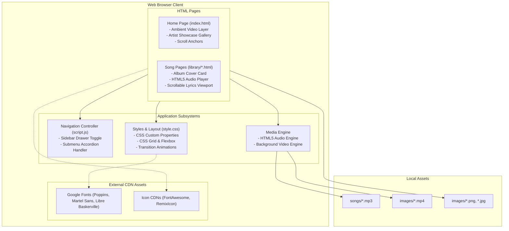

# System Architecture

## 1. Overview

Mezu - Music Library is a static multi-page web application built with HTML5, CSS3, and vanilla JavaScript. The architecture relies on client-side browser standards without external JavaScript frameworks or runtime build steps.

---

## 2. Core Subsystems

### 2.1 Navigation Drawer and Submenu
The navigation drawer (`.sidebar`) provides persistent navigation across the application:

- Drawer Toggle: Handled in `script.js` by listening to click events on `#sidebar-close`. When clicked, the `.close` class is toggled on `.sidebar`. In `style.css`, sibling selectors (`.sidebar.close ~ .navbar`, `.sidebar.close ~ .main`) adjust the main content width from `calc(100% - 260px)` to `100%`.
- Two-Tier Sliding Submenu:
  - Top-level menu items with submenus contain the `.submenu-item` class.
  - When clicked, JavaScript adds `.submenu-active` to `.menu-content` and `.show-submenu` to the active item.
  - The top menu translates horizontally (`transform: translateX(-56%)`), revealing the nested `.submenu` list.
  - Clicking the back title button removes `.submenu-active`, resetting the view.

### 2.2 HTML5 Audio Playback
Each song page under `library/` embeds a standard HTML5 `<audio>` element with native controls:

- Controls: Play/pause, playback progress scrubber, elapsed time display, and volume slider.
- Source Resolution: Points to local files in the `songs/` directory via relative paths (`../songs/...`).
- Browser Decoding: Audio decoding and buffering are handled directly by the browser's native media engine.

### 2.3 Lyrics Display Viewport
The lyrics interface is structured inside `<section class="lyrics__container">`:

- Card Geometry: Displayed in a card container (`.song__lyrics`) with a fixed width (`35rem`), height (`31.5rem`), and rounded corners (`border-radius: 1.5rem`).
- Independent Scrolling: Uses `overflow-y: auto` with WebKit scrollbar hiding (`display: none;`) to allow vertical scrolling through lyrics without shifting the outer page.

### 2.4 Artist Showcase Gallery
The homepage (`index.html`) serves as an artist discovery gallery:

- Section Anchoring: Featured artists are mapped to section IDs (`#brunomajor`, `#demi`, `#denisejulia`, `#khalid`, `#lanadelrey`, `#newjeans`).
- Visual Layout: Each section displays a full-viewport image (`.home__image img`) with `object-fit: cover`.
- Smooth Scrolling: Enabled globally using `html { scroll-behavior: smooth; }`.

### 2.5 Ambient Video Background
- Located in `<section class="sectionhome" id="home">` using an HTML5 `<video>` tag.
- Configured with `autoplay loop muted` attributes to meet modern browser autoplay policies.
- Renders `images/bg-vid.mp4` on the home page and `images/bg-vid2.mp4` on track detail pages.

---

## 3. External Dependencies

| Asset | Source | Location | Purpose |
| :--- | :--- | :--- | :--- |
| FontAwesome | CDN (cdnjs) | `https://cdnjs.cloudflare.com/ajax/libs/font-awesome/6.2.1/css/all.min.css` | UI iconography (chevrons, hamburger menu) |
| RemixIcon | CDN (jsdelivr) | `https://cdn.jsdelivr.net/npm/remixicon@2.5.0/fonts/remixicon.css` | Audio and multimedia glyphs |
| Google Fonts | Google Fonts API | `https://fonts.googleapis.com/...` | Typefaces (Poppins, Martel Sans, Libre Baskerville) |
